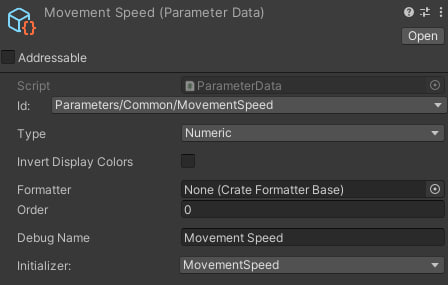
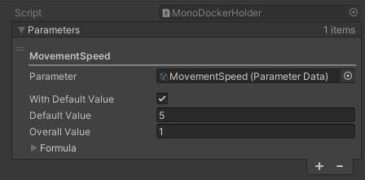
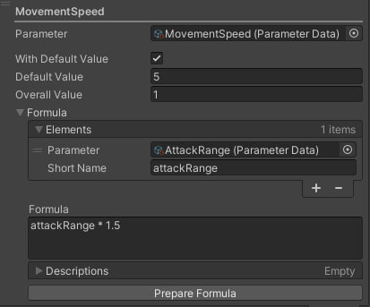

<p align="center">

</p>

# Parameter System

Простая и удобная в использовании система статов/параметров

## Зависимости

- [Scellecs.Collections](https://github.com/scellecs/collections)
- [Qw1nt.SelfId](https://github.com/Qw1nt/unity.self-id)

## Установка

Через <b>.unitypackage</b>

## Основное

1) Одно хранилище для всех параметров объекта - `Docker`,
2) Каждый параметр имеет набор значений, из которых происходит его расчёт,
3) Каждый `Docker` может иметь один родительский `Docker` и множество дочерних,
4) Данные родительского `Docker` влияют на расчёт дочерних,
5) Параметры поддерживают формулы расчёта, уникальные для каждого `Docker`

## Параметр

У каждого параметра есть 2 значения - `overall` и `value`, `overall` - %, на который умножается `value`. 

Например, если у `MovementSpeed` `value` = 10, а `overall` = 0.5(50%), то `MovementSpeed.GetValue()` вернёт 5.


### Создание 

1) Добавление нового Id; см. [unity.self-id](https://github.com/Qw1nt/unity.self-id)
2) Объявление нового типа  `MovementSpeed`

```csharp
using Parameters.Runtime.Attributes;

namespace Runtime
{
    [Parameter(typeof(float))]
    public partial struct MovementSpeed
    {
        
    }
}
```

> [!IMPORTANT]
> Аргумент в `[Parameter(typeof(float))]` отвечает за то, к какому типу будет приводится параметр.

3) Создание ScriptableObject параметра: `Create -> Parameters -> Parameter Data`
4) Задать ранее созданный ID
5) Задать инициализатор

### Вид Scriptable Object'а 


> [!IMPORTANT]
> Инициализатор всегда имеет такое же название, что и параметр

### Инициализация
На любой объект сцены нужно добавить `ParameterInitializerMonoProvider`.

После запуска сцены все валидные параметры проинициализируются и смогут быть использованы.

## Docker

Чтобы привязать `Docker` к объекту нужно добавить на него компонент `MonoDockerHolder` 



> Для примера был добавлен параметр `MovementSpeed`

### Расчёты

Все `Docker` можно считать отдельно, для этого нужно воспользоваться `SimpleDockerCalculator.Calculate(docker)`. 

Чтобы все созданные `Docker` считались автоматически необходимо добавить компонент `DockerCalculatorMonoProvider` на любой объект на сцене 

### Использование

Код передвижения игрока с использованием параметров будет выглядеть так:
```csharp
using Parameters.Runtime.Common;
using Parameters.Runtime.Types;
using UnityEngine;

namespace Runtime
{
    [RequireComponent(typeof(MonoDockerHolder))]
    public class PlayerMovement : MonoBehaviour
    {
        private MovementSpeed _movementSpeed;

        private void Awake()
        {
            _movementSpeed = GetComponent<MonoDockerHolder>().Docker.GetMovementSpeed();
        }

        private void Update()
        {
            var horizontal = Input.GetAxis("Horizontal");
            var vertical = Input.GetAxis("Vertical");

            transform.position += new Vector3(horizontal, vertical, 0f) * _movementSpeed.GetValue() * Time.deltaTime;
        }
    }
}
```
> [!IMPORTANT]
> Для каждого параметра автоматически генерируются extension-методы получения, они имеют вид `Get`/`TryGet` + `Название параметра`

### Добавление/ Удаление/ Изменение параметров

```csharp
using Parameters.Runtime.Common;
using Parameters.Runtime.Types;
using UnityEngine;

namespace Runtime
{
    [RequireComponent(typeof(MonoDockerHolder))]
    public class PlayerMovement : MonoBehaviour
    {
        private MovementSpeed _movementSpeed;
        private ParameterRawValue _cachedParameter;

        private void Awake()
        {
            _movementSpeed = GetComponent<MonoDockerHolder>().Docker.GetMovementSpeed();
            
            // Будет добавлено +1 к параметру "MovementSpeed"
            _movementSpeed.Ref.Add(new ParameterRawValue(1f));
            
            _cachedParameter = new ParameterRawValue(1f);

            // Будет добавлено +1 к параметру "MovementSpeed"
            _movementSpeed.Ref.Add(_cachedParameter);
        }

        private void Update()
        {
            if (Input.GetKeyDown(KeyCode.F) == true)
            {
                _cachedParameter.CleanValue += 5f;
                
                // Будет добавлено +5 к параметру "MovementSpeed"
                _movementSpeed.Ref.Update(ref _cachedParameter);
            }

            if (Input.GetKeyDown(KeyCode.K) == true)
            {
                // Параметр будет удалён. Значение параметра "MovementSpeed" станет 5 + 1
                // 5 - начальное значение, 1 - значение добавленное в "Awake()"
                _movementSpeed.Ref.Delete(ref _cachedParameter);
            }
            
            var horizontal = Input.GetAxis("Horizontal");
            var vertical = Input.GetAxis("Vertical");

            transform.position += new Vector3(horizontal, vertical, 0f) * _movementSpeed.GetValue() * Time.deltaTime;
        }
    }
}
```

### Формулы

Формула состоит из нескольких чатсей: 
1) `Elements` - параметры, влияющие на расчёт,
2) `Formula` - выражение,
3) `Descriptions` - результат разбора выражени в пошаговые операции,
4) Кнопка `Prepare Formula` - подготавливает выражение и заполняет `Descriptions`



> В этом примере на значение параметра `MovementSpeed` влияет параметр `AttackRange` 

> [!IMPORTANT]
> Все параметры, находящиеся в `Elements` должны быть зарегистрированы в `Docker`

## Defines

``PARAMETERS_TRI_INSPECTOR`` - Интеграция с [TriInspector](https://github.com/codewriter-packages/Tri-Inspector)

``PARAMETERS_UINITY_LOCALIZATION`` - Интеграция
с [Unity.Localization](https://docs.unity3d.com/Packages/com.unity.localization@1.5/manual/index.html)

```PARAMETERS_UNITASK``` - Интеграция с [UniTask](https://github.com/Cysharp/UniTask)